晨游圆明园
=================
####总述####
    是这一个小时让这几天值得一提，意外收获几份乐趣。
----------------------------------------------------
####前序####
    凌晨半时还在考虑，去不去圆明园，最后还是决定去一下，反正要去的地方小，安排一个小时不影响整体安排。

####一路游园####
    依旧是这个时候就起来了，然后就自己走到东门，等了几分钟就入园了，第一个进入西洋楼景区，
	感觉到一种不一样的感觉。
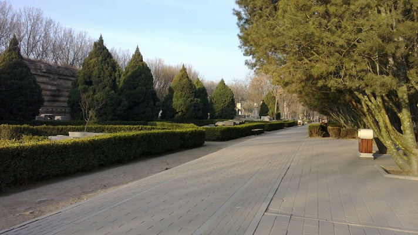

	西洋楼景区一进去就是大水法，这个自己还是知道的,见到大水法，只是没想到现在有了铁栅栏。
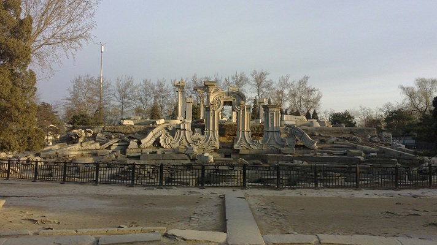

	早上，拍其后面总因为光线和设备（手机）不能很好的拍大水法后面这些建筑。
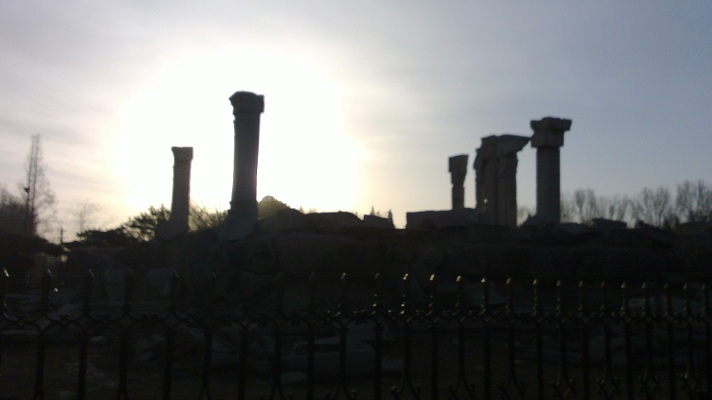

     也许这个角度还好。
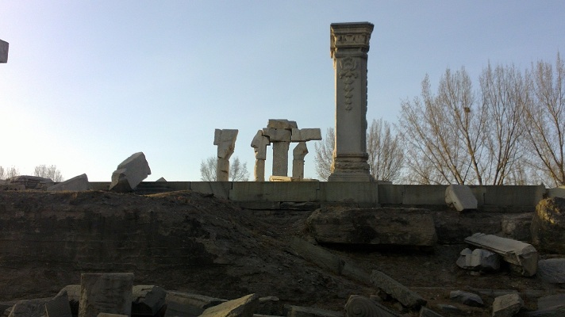

     只不过沿着记忆或者说是感觉，往前走，反正都拍了两张了，就沿路来几张好了。
	 （自己向来是不愿拍照，不过一个人的圆明园，感觉蛮好，谁让我滴一个进来呢）
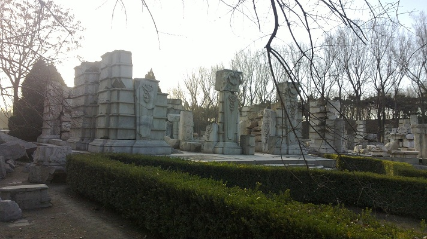

     对，就是下面这个地方，自己打算再走走就立刻回去，迷宫，本叫黄花阵。	 
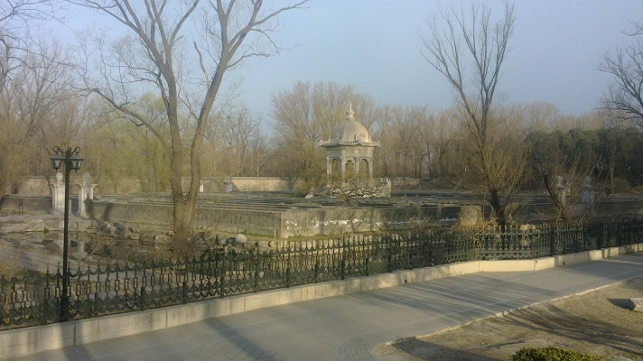	 

     哈哈，so easy就到了中间！
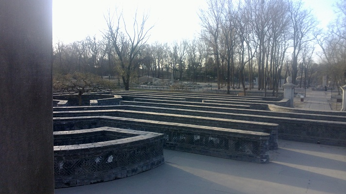

     然后，然后...就发现了第二个惊喜--一抹春色！
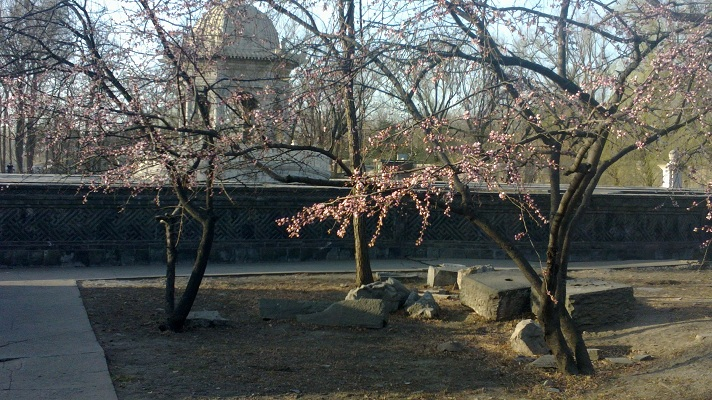

	这简直算得上什么来着，整个几天，唯一一个给人有生命力的感觉。
	并且就此一棵树！若是不回头，估计这次就真错过什么。
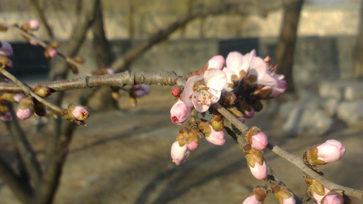	

     每一朵花都被看见，记下这一处作为留恋，作为下次拜访的理由。
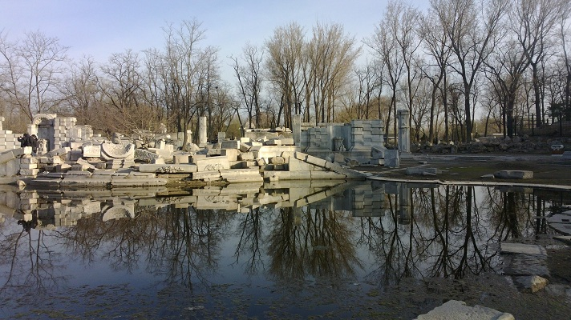

     这个地方的美本不属于我，是另一种景色带我发现了这个神奇的视角。
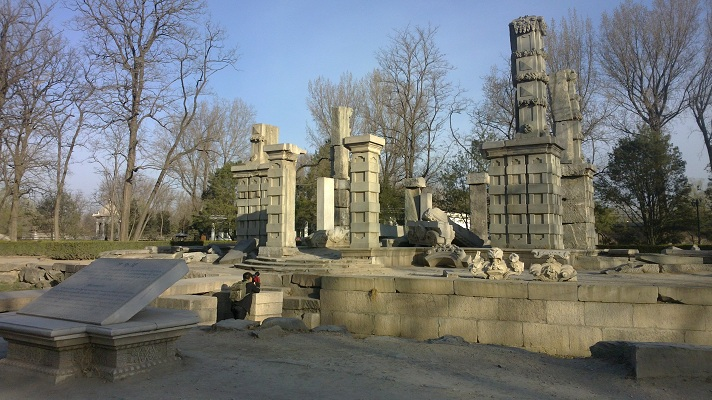

     做事认真的人本来就构成一种景色。错过了这一抹景色，就不知道来的路和
	 去的路上会错过多少景色。

####离开####
    人越来越多了，自己的一个小时也因这些意外的收获而被用得满满当当的，于是
	在熙攘中离开这里，离开了帝都，带着这份意外的喜悦。
---------------------
####总述####
	 圆明园西洋楼的建筑是令人印象深刻。
	 这种深刻固然包含其整体规模较大和体系结构的完整，
	 不同建筑群自成体系又相互融为一体。
	 
	 但其深刻之处还在于细节，这个自己一直记忆犹新。

---------------------
2014/3/18 
于T15上 
Thank虾虾给换的卧铺票，不然也不会有地方写这篇游记。